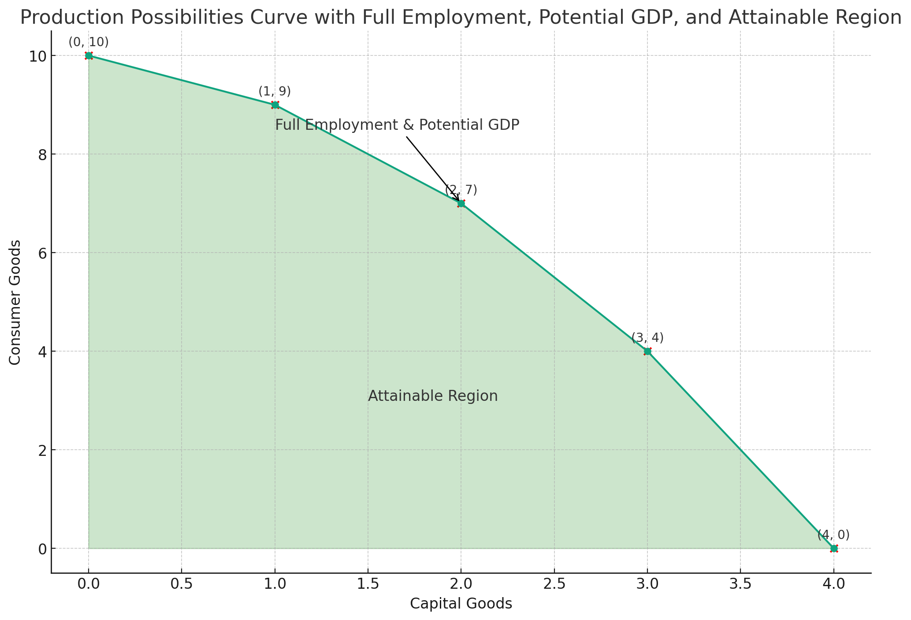
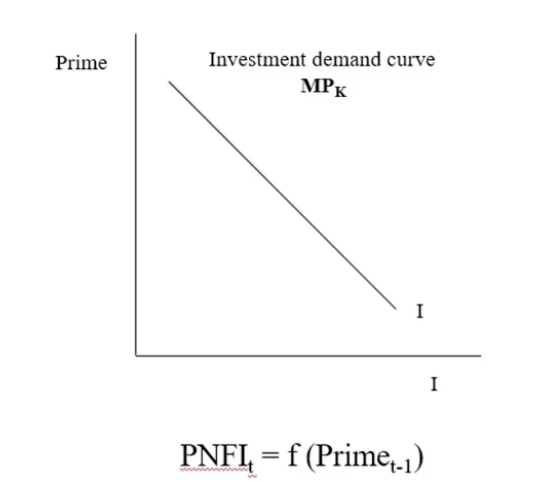
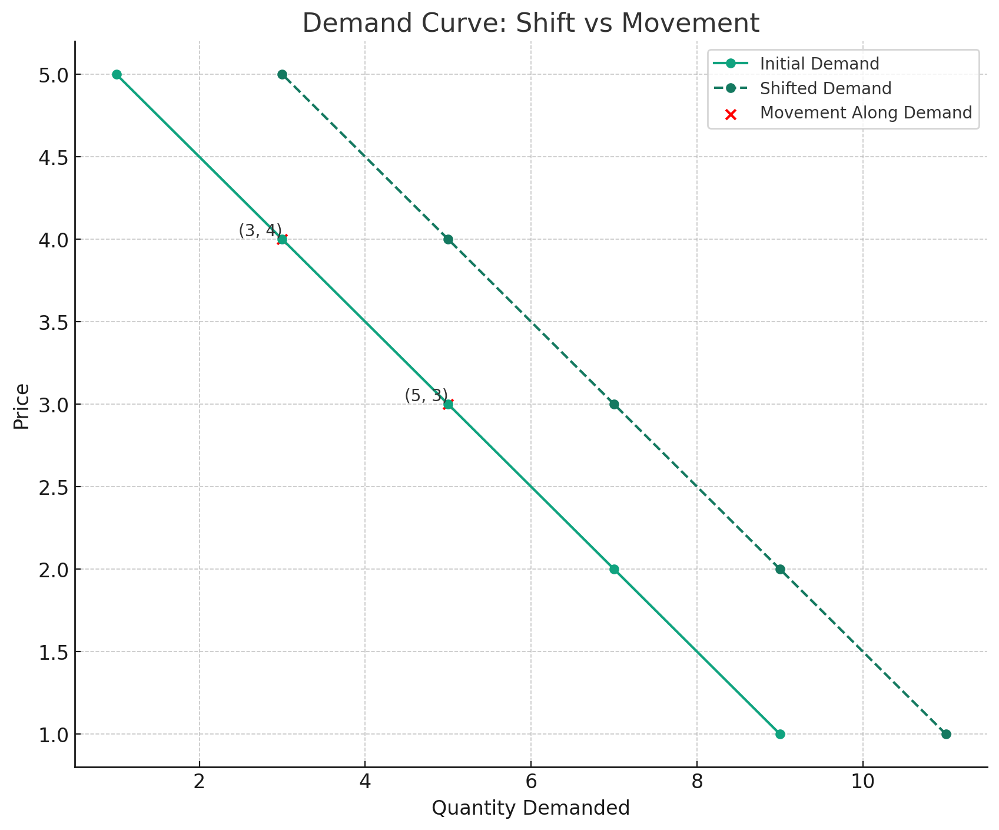
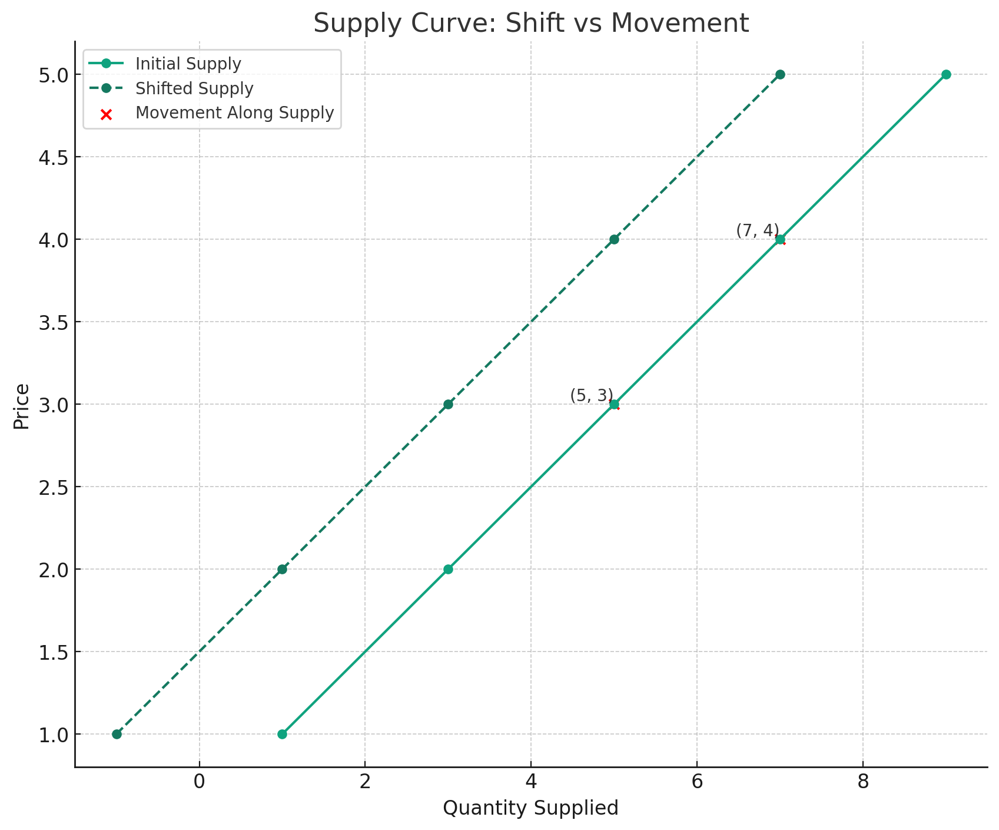
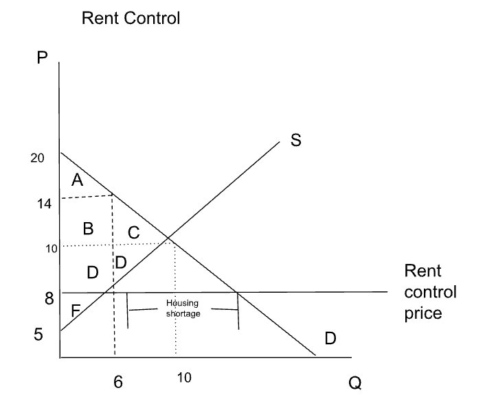

# Microeconomics Exam 1 Notes

## Economics

Study of how scarce productive resources are allocated among alternative uses and how the resulting commodities are distributed.

- **Land** - Natural resources
- **Labor** - Human resources
- **Capital** - Tools, equipment, and factories. Human Capital is the knowledge and skills of workers. Entrepreneurship is the ability to organize and manage the other factors of production.

## Pitfalls to Economic Models

### Post hoc ergo propter hoc

After this, therefore because of this

In other words, correlation does not imply causation.

### Fallacy of composition

What is true for the individual is not necessarily true for the group.

## Economic Statements

### Positive Economic Statement

A statement that can be tested and validated. It is a statement of **fact**.

### Normative Economic Statement

A statement that cannot be tested or validated. It is an **opinion**.

## Ockham's Razor

The simplest explanation is usually the correct one.

Kiss - Keep it simple stupid

## Opportunity Cost

The value of the next best alternative.

### Example

Alexi and Tony own a food truck and output the following:

|       | Street Tacos | Cuban Sandwiches |
| ----- | ------------ | ---------------- |
| Alexi | 80           | 20               |
| Tony  | 100          | 30               |

#### What is the Opportunity Cost for a street taco?

Alexi:

$$\frac{20 \text{ Cuban Sandwiches}}{80 \text{ Street Tacos}} = \frac{1}{4} \text{ Cuban Sandwiches per Street Taco}$$

Tony:

$$\frac{30 \text{ Cuban Sandwiches}}{100 \text{ Street Tacos}} = \frac{3}{10} \text{ Cuban Sandwiches per Street Taco}$$

Alexi has a lower opportunity cost for a street taco, and thus the **comparative advantage**.

## Inflation

Ways to measure inflation:

- **Consumer Price Index (CPI)** - Measures the change in the price of a basket of goods and services purchased by a typical household.
- **Personal Consumption Expenditures (PCE)** - Like the CPI, but it is a broader measure of the goods and services purchased by households.
- **GDP Deflator** - Measures the change in the price of all goods and services produced in the economy.

### Inflation Rate from CPI

$$
\text{Inflation Rate} = \frac{\text{CPI}_t - \text{CPI}_{t-1}}{\text{CPI}_{t-1}} \times 100
$$

- **Headline Inflation** - The inflation rate calculated using the CPI.
- **Core Inflation** - The inflation rate calculated using the CPI, but excluding food and energy prices.

## Production Possibilities Frontier

### Assumptions

- Only two goods can be produced:
  - **Consumer Goods** - Goods produced for consumption by households.
  - **Capital Goods** - Goods produced for consumption by businesses.
- The economy is operating at full employment and efficiently
- Fixed resources
- Constant technology level

### Production Possibilities Curve

Take the following data:

| Capital Goods | Consumer Goods | Opportunity Cost of Capital Goods |
| ------------- | -------------- | --------------------------------- |
| 0             | 10             | -                                 |
| 1             | 9              | 1                                 |
| 2             | 7              | 2                                 |
| 3             | 4              | 3                                 |
| 4             | 0              | 4                                 |

- **Productive Efficiency** - The economy is producing at a point on the PPC. On the curve.
- **Allocative Efficiency** - The economy is producing at the point on the PPC that is most desired by society.

**Law of Increasing Opportunity Cost** - As more of a good is produced, the opportunity cost of producing that good increases.

## Private Non-Residential Fixed Investment

$$PNFI = b + m \times Prime$$

- **PNFI** is the amount of money invested in the economy (billions of dollars)
- **Prime** is the prime interest rate (%) (the rate banks charge their best customers)
- **b** is the y-intercept (the amount of money invested in the economy when the prime interest rate is 0%)
- **m** is the slope (the change in the amount of money invested in the economy when the prime interest rate increases by 1%) Should be negative.

### Is model statistically significant?

- **$|t| > 2$** - Statistically significant
- **$P < 0.05$** - Statistically significant
- **C.I. does not include 0** - Statistically significant

- **$R^2$** - The percentage of the variation in the dependent variable that is explained by the independent variable.
- **Standard Error** - The average distance between the actual data points and the regression line.

## Supply and Demand

### Demand

#### Shifters

- **Income** - Increase of income shifts the demand curve to the **right**.
- **Price of Related Goods** - Increase in the price of a substitute shifts the demand curve to the **right**. Increase in the price of a complement shifts the demand curve to the **left**.

### Supply

#### Shifters

- **Input Prices** - Increase in input prices shifts the supply curve to the **left**.
- **Technology** - Increase in technology shifts the supply curve to the **right**.

### Surplus

**Consumer Surplus** - The difference between the maximum price a consumer is willing to pay and the price they actually pay.

**Producer Surplus** - The difference between the minimum price a producer is willing to accept and the price they actually receive.

**Choke Price** - The price at which the quantity demanded equals zero.

#### Example

Given:

$$
Q_d = 152 - 20P \\
Q_s = -4 + 188P \\
$$

Find $C_S$ and $P_S$.

$$
152 - 20P = -4 + 188P \\
156 = 208P \\
P_e = 0.75 \\
Q_e = 152 - 20(0.75) = 137 \\
$$

Find the maximum price a consumer is willing to pay:

$$
152 - 20P = 0 \\
P_{max} = 7.6 \\
$$

Find the minimum price a producer is willing to accept (choke price):

$$
-4 + 188P = 0 \\
P_{min} = 0.0213 \\
$$

Find the consumer surplus:

$$
C_S = \frac{1}{2}(7.6 - 0.75)(137) = 469 \\
$$

We get this equation by taking the area of a triangle with base $Q_e$ and height $P_{max}$.

Find the producer surplus:

$$
P_S = \frac{1}{2}(0.75 - 0.0213)(137) = 51 \\
$$

## Price Controls

### Price Ceiling

A maximum price that can be charged for a good or service. (set by the government)

#### Example

Given:

$$
Q_d = 20-P \\
Q_s = 2P-10\\
$$

If a price ceiling of $8 is set, how is producer and consumer surplus affected?

##### Step 1: Find choke prices

$$
20-P = 0 \\
P_{max,demanded} = 20 \\

2P-10 = 0 \\
P_{min,supplied} = 5 \\
$$

##### Step 2: Q_s and Q_d after price ceiling

$$
Q_s = 2(8)-10 = 6 \\
$$

$$
6 = 20-P \\
P = 14 \\
$$

This is the price that consumers would have been willing to pay at that supply level.

##### Step 3: Find new consumer and producer surplus

$$
C_{S,a} = \frac{1}{2}(20-14)(6) = 18 \\
C_{S,b,d} = (14-8)*6 = 36 \\
C_{S} = 18 + 36 = 54 \\
$$

$$
P_S = \frac{1}{2}(8-5)(6) = 9 \\
$$

**Dead Weight Loss**: The area between the supply and demand curves that comes after the price ceiling Q on the supply curve.

**Producer Surplus**: The area between the supply curve and the price ceiling Q.

**Consumer Surplus**: The area between the demand curve and the price ceiling Q.
## Elasticity

**Elasticity** - A measure of the responsiveness of one variable to changes in another variable.

- Price Elasticity of Demand
- Price Elasticity of Supply
- Income Elasticity of Demand
- Cross-Price Elasticity of Demand

We will focus on Price Elasticity of Demand.

$$
\epsilon = \frac{\%\Delta Q}{\%\Delta P} = \frac{\Delta Q/Q_{avg}}{\Delta P/P_{avg}} \\
$$

- If $\epsilon > 1$ then demand is elastic.
- If $\epsilon = 1$ then demand is unit elastic.
- If $\epsilon < 1$ then demand is inelastic.

### Example

$$
Q_d = 286 - 20P
$$

| P   | Q_d | $\epsilon_d$ |
| --- | --- | ------------ |
| 6   | 166 | -0.72        |
| 7   | 146 | -0.96        |
| 8   | 126 | -1.27        |

How did we get $\epsilon_d$?

$$
\epsilon_d = \frac{\%\Delta Q}{\%\Delta P} \\
$$

$$
\%\Delta Q = \frac{Q_2 - Q_1}{Q_1} \\
\%\Delta Q = \frac{146 - 166}{166} = -0.12 \\
$$

$$
\%\Delta P = \frac{P_2 - P_1}{P_1} \\
\%\Delta P = \frac{7 - 6}{6} = 0.167 \\
$$

$$
\epsilon_d = \frac{-0.12}{0.167} = -0.72 \\
$$

### What affects elasticity?

- Number of substitutes
- Price relative to income
- Necessities vs luxuries
- Time allowed for adjustment to change in price

### Cross Price Elasticity of Demand

The responsiveness of the quantity demanded of one good to changes in the price of another good.

$$
\epsilon_{xy} = \frac{\%\Delta Q_x}{\%\Delta P_y} \\
$$

- If $\epsilon_{xy} > 0$ then the goods are **substitutes**.
- If $\epsilon_{xy} < 0$ then the goods are **complements**.

### Income Elasticity of Demand

The responsiveness of the quantity demanded to changes in income.

$$
\epsilon_{I} = \frac{\%\Delta Q}{\%\Delta I} \\
$$

- If $\epsilon_{I} > 0$ then the good is a **normal good**.
- If $\epsilon_{I} < 0$ then the good is an **inferior good**.

## Other Important Concepts / Terms

- **Recession** - Two consecutive quarters of negative GDP growth.
- **Depression** - A severe recession (10% or more decline in GDP).

- **Ceteris Paribus** - All other things held constant.

- **Marginal Cost** - The additional cost of producing one more unit of output.

- **Laissez-Faire** - The government should not interfere with the economy. (Adam Smith)

- **Command Economy** - The government should control the economy. (Karl Marx)
