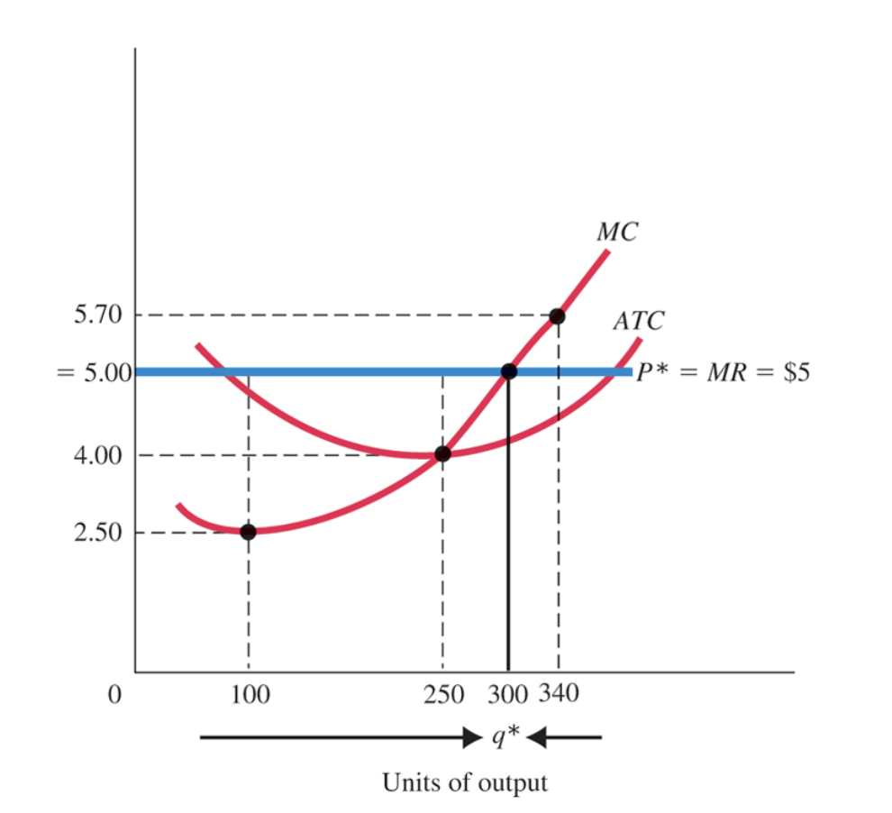
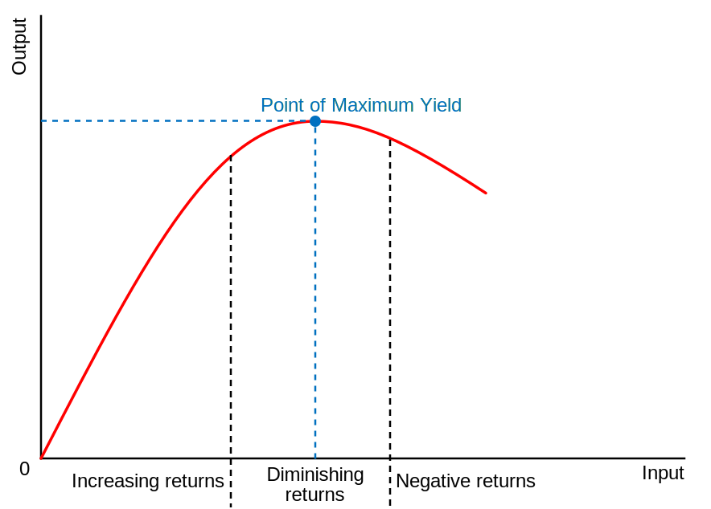
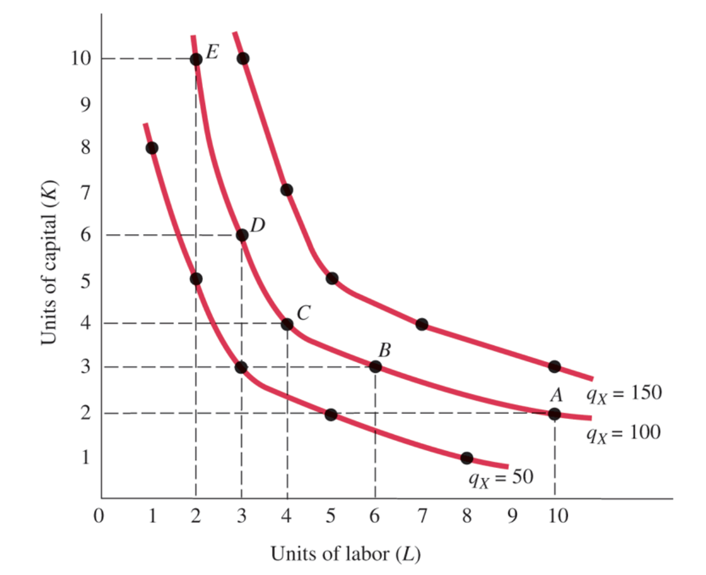
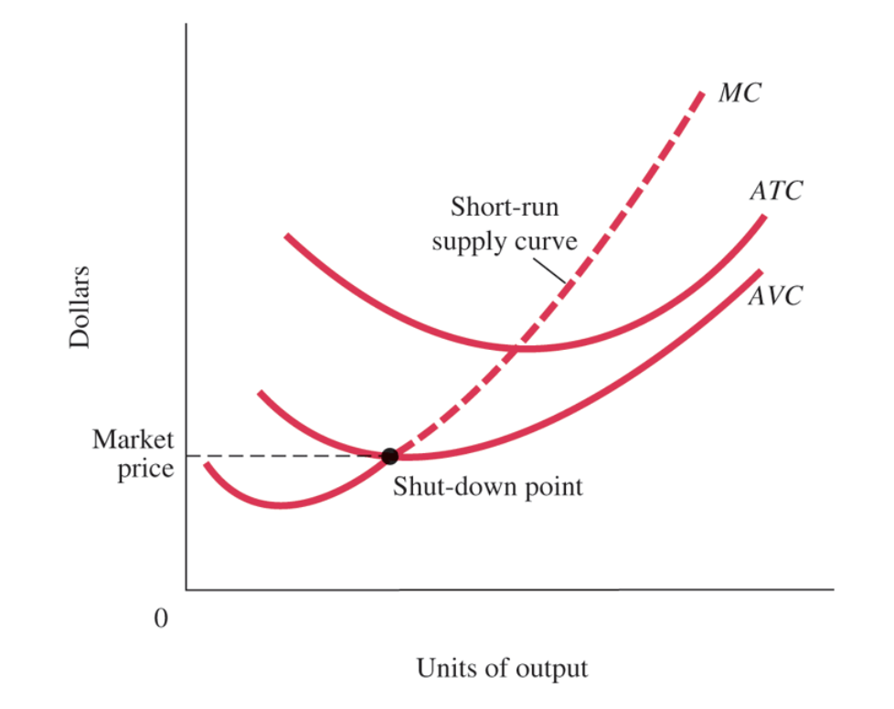
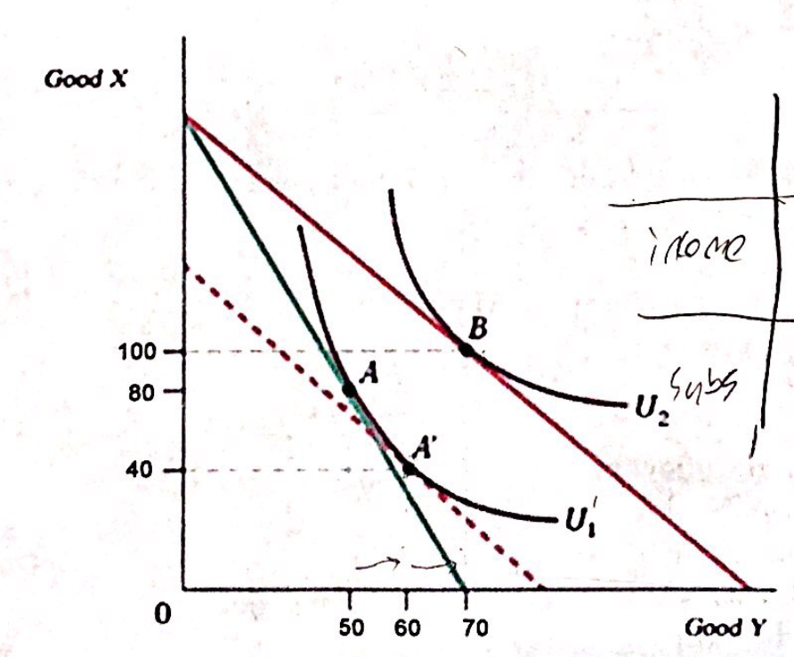

# Microeconomics Exam 2 Notes

## Price Taker

**Perfect Competition** exists when:

- There are many buyers and sellers
- They produce homogeneous (identical) products
- There is free entry and exit (no barriers entry for new firms to enter the market)

A **price taker** is a firm that cannot influence the price of a good or service. They must accept the market price.

Example, a farmer selling wheat.

- The farmer is a price taker because they cannot influence the price of wheat.
- If they charge more than the market price, they will not sell any wheat because there are many other farmers selling the exact same wheat at the market price.
- If they charge less than the market price, they will sell all of their wheat, but they will be losing money because they could have sold it at the market price.

## Total Revenue

$$
TR = P \times Q
$$

Where:

- $TR$ is total revenue
- $P$ is price
- $Q$ is quantity

## Marginal Revenue

$$
MR = \frac{\Delta TR}{\Delta Q}
$$

Where:

- $MR$ is marginal revenue
- $\Delta TR$ is the change in total revenue
- $\Delta Q$ is the change in quantity

So its the amount of additional revenue that a firm receives from selling one more unit of output.

In a perfectly competitive market, the price is constant, so the marginal revenue is equal to the market price.
Thus, the **Marginal Revenue Curve** is a horizontal line at the market price.

## MRC for a small firm

In this graph:

- **MC** is the marginal cost curve. This is the cost of producing one more unit of output.
- **MR** is the marginal revenue curve. This is the revenue from selling one more unit of output.
- **P\*** is the market price. This is the price that the firm must accept. It is also the marginal revenue because we are in a perfectly competitive market.
- **ATC** is the average total cost curve. This is the average cost of producing one unit of output. It's different from the marginal cost because it is the total cost divided by the quantity, not the change in total cost divided by the change in quantity.

## Marginal Productivity

**Marginal Productivity** is the additional output that can be produced by adding one more unit of input.

$$
MP = \frac{\Delta Q}{\Delta I}
$$

Where:

- $MP$ is marginal productivity
- $\Delta Q$ is the change in output
- $\Delta I$ is the change in input

### Law of Diminishing Marginal Productivity

**Law of Diminishing Marginal Productivity** - As more of a variable input is added to a fixed input, the marginal productivity of the variable input eventually decreases.

## Isoquant

An **isoquant** is a curve that shows all of the combinations of inputs that produce the same level of output.

For example the following shows all of the combinations of labor ($L$) and capital ($K$) various levels of output ($Q$).

| 100 Units of Output | $Q_x = 50$ |     | $Q_x = 100$ |     | $Q_x = 150$ |     |
| ------------------- | ---------- | --- | ----------- | --- | ----------- | --- |
|                     | K          | L   | K           | L   | K           | L   |
| A                   | 1          | 8   | 2           | 10  | 3           | 10  |
| B                   | 2          | 5   | 3           | 6   | 4           | 7   |
| C                   | 3          | 3   | 4           | 4   | 5           | 5   |
| D                   | 5          | 2   | 6           | 3   | 7           | 4   |
| E                   | 8          | 1   | 10          | 2   | 10          | 3   |

### Slope of an Isoquant

$$
\dfrac{\Delta K}{\Delta L} = -\dfrac{MP_L}{MP_K}
$$

Where:

- $\Delta K$ is the change in capital
- $\Delta L$ is the change in labor
- $MP_L$ is the marginal productivity of labor
- $MP_K$ is the marginal productivity of capital

Why?

Output is constant. So the loss of output from a decrease in labor must be offset by an increase in capital.

We know that the marginal productivity is the change in output divided by the change in input. So we can take their ratio to see exactly how much we need to increase capital to offset the loss of labor.

## Marginal Utility

**Marginal Utility** is the additional utility that a consumer receives from consuming one more unit of a good or service.

For example the amount of days you choose to go to a NY Giants game:

| Days | Total Utility | Marginal Utility |
| ---- | ------------- | ---------------- |
| 0    | 0             |                  |
| 1    | 10            | 10               |
| 2    | 18            | 8                |
| 3    | 24            | 6                |
| 4    | 28            | 4                |

### Utility Maximization

A consumer will maximize their utility when:

$$
\dfrac{MU_x}{P_x} = \dfrac{MU_y}{P_y}
$$

Where:

- $MU_x$ is the marginal utility of good $x$
- $P_x$ is the price of good $x$
- $MU_y$ is the marginal utility of good $y$
- $P_y$ is the price of good $y$

This is true because the consumer will continue to buy more of a good until the marginal utility per dollar spent is equal for all goods.

If

$$
\dfrac{MU_x}{P_x} > \dfrac{MU_y}{P_y}
$$

Then the consumer will buy more of good $x$ and less of good $y$. This in turn will decrease the marginal utility of good $x$ due to the law of diminishing marginal utility.

Eventually the marginal utility of good $x$ will be equal to the marginal utility of good $y$ and we are at the maximum utility.

## Short Run

The **short run** is the period of time in which at least one input is fixed.

For example, a firm may be able to change the amount of labor they use, but they cannot change the amount of capital they use.

### To close or not to close

A firm should **shut down** if the revenue from producing is less than the variable cost of producing.

In this graph:

- **MC** is the marginal cost curve. This is the cost of producing one more unit of output.
  - $MC = \dfrac{\Delta TC}{\Delta Q}$
- **ATC** is the average total cost curve. This is the total cost divided by the quantity.
  - $ATC = \dfrac{TC}{Q}$
- **AVC** is the average variable cost curve. This is the variable cost divided by the quantity.
  - $AVC = \dfrac{VC}{Q}$
  - Variable cost is the cost of producing one unit of output exactly. It does not include costs that are not directly related to the production of the good. Like the cost of the building, or the cost of the CEO's salary.

The firm should shut down if the market price is less than the AVC. The short-run supply curve is the portion of the marginal cost curve that is above the AVC curve. This is because the firm will not produce if the price is less than the AVC.

## Long Run

The **long run** is the period of time in which all inputs are variable.

## Cost Minimization

A firm will minimize their cost when:

$$\dfrac{MP_L}{P_L} = \dfrac{MP_K}{P_K} = \dfrac{MP_A}{P_A} = ...$$

Suppose $\dfrac{MP_L}{P_L} > \dfrac{MP_K}{P_K}$

Then the firm should hire more labor. This will decrease productivity of labor until $\dfrac{MP_L}{P_L} = \dfrac{MP_K}{P_K}$

## Production Function

A **production function** is the relationship between the quantity of inputs used to make a good and the quantity of output of that good.

| (1) Labor Units (Employees) | (2) Total Product (Sandwiches per Hour) | (3) Marginal Product of Labor | (4) Average Product of Labor (Total Product ÷ Labor Units) |
| --------------------------- | --------------------------------------- | ----------------------------- | ---------------------------------------------------------- |
| 0                           | 0                                       | -                             | -                                                          |
| 1                           | 10                                      | 10                            | 10.0                                                       |
| 2                           | 25                                      | 15                            | 12.5                                                       |
| 3                           | 35                                      | 10                            | 11.7                                                       |
| 4                           | 40                                      | 5                             | 10.0                                                       |
| 5                           | 42                                      | 2                             | 8.4                                                        |
| 6                           | 42                                      | 0                             | 7.0                                                        |

As you can see the marginal product of labor decreases as the number of employees increases. This is the law of diminishing marginal productivity.

## Example - Breaking apart total cost

$$
TC = 4000 + 5Q + 10Q^2
$$

### Total Fixed Cost

$$
TFC = 4000
$$

### Total Variable Cost

$$
TVC = 5Q + 10Q^2
$$

### Average Total Cost

$$
ATC = \dfrac{TC}{Q} = \dfrac{4000 + 5Q + 10Q^2}{Q} = 4000/Q + 5 + 10Q
$$

### Average Fixed Cost

$$
AFC = \dfrac{TFC}{Q} = \dfrac{4000}{Q} = 4000/Q
$$

### Average Variable Cost

$$
AVC = \dfrac{TVC}{Q} = \dfrac{5Q + 10Q^2}{Q} = 5 + 10Q
$$

### Marginal Cost

$$
MC = \dfrac{\Delta TC}{\Delta Q} = \dfrac{5 + 20Q}{1} = 5 + 20Q
$$

(Take the derivative of the total cost function with respect to $Q$)

### Minimum Average Total Cost

$$
ATC = MC
$$

This will be the minimum because if the ATC is less than the MC, then the ATC will decrease as we increase the quantity. If the ATC is greater than the MC, then the ATC will increase as we increase the quantity.

$$
4000/Q + 5 + 10Q = 5 + 20Q \\
4000/Q = 10Q \\
4000 = 10Q^2 \\
Q = 20 \\
$$

$$
ATC = 4000/20 + 5 + 10(20) = 405
$$

## Utility Maximization

| $Q$ | $TU_s$ | $MU_s$ | $MU_{s}/P_s$ | $TU_p$ | $MU_p$ | $MU_{p}/P_p$ |
| --- | ------ | ------ | ------------ | ------ | ------ | ------------ |
| 0   | 0      | --     | --           | 0      | 0      | --           |
| 1   | 8      | 8      | 8            | 10     | 10     | 5            |
| 2   | 14     | 6      | 6            | 19     | 9      | 4.5          |
| 3   | 18     | 4      | 4            | 27     | 8      | 4            |
| 4   | 21     | 3      | 3            | 34     | 7      | 3.5          |
| 5   | 23     | 2      | 2            | 40     | 6      | 3            |
| 6   | 24     | 1      | 1            | 45     | 5      | 2.5          |

- $P_p$ = $2
- $P_s$ = $1
- $I$ = 14

### 1.) Find total utility maximization

$$
\dfrac{MU_s}{P_s} = \dfrac{MU_p}{P_p} \\
\dfrac{MU_s}{1} = \dfrac{MU_p}{2} \\
MU_s = 2MU_p \\
$$

We must use all our income as well

$$
I = P_sQ_s + P_pQ_p \\
14 = Q_s + 2Q_p \\
Q_s = 14 - 2Q_p \\
$$

## Risks

- **Risk Averse** - A person who prefers a certain income to a risky income with the same expected value.
  - Exhibit decreasing marginal utility of income because they do not want to lose money.
- **Risk Neutral** - A person who is indifferent between a certain income and a risky income with the same expected value.
- **Risk Loving** - A person who prefers a risky income to a certain income with the same expected value.

- **Risk Premium** - The maximum amount of money that a risk averse person will pay to avoid taking a risk.
  - $RP = E(Risky) - Certain$
  - Example: If you would pay $5 to avoid a 50% chance of losing $10, then your risk premium is $5.

## Income Effect and Substitution Effect

- **Substitution Effect** - The change in the quantity demanded of a good that results from a change in price making the good more or less expensive relative to other goods that are substitutes.
- **Indifference Curve** - A curve that shows the combinations of consumption bundles that give the consumer the same utility.
- **Marginal Rate of Substitution** - The rate at which a consumer is willing to trade one good for another.
  - $MRS = \dfrac{\Delta Y}{\Delta X}$
  - Where $Y$ is the quantity of good $Y$ and $X$ is the quantity of good $X$.
- **Budget Constraint Line** - The set of consumption bundles that the consumer can afford given their income and the prices of goods.
  - $P_xX + P_yY = I$
  - Where $P_x$ is the price of good $X$, $X$ is the quantity of good $X$, $P_y$ is the price of good $Y$, $Y$ is the quantity of good $Y$, and $I$ is the income of the consumer.
  - The slope of this line is $-\dfrac{P_x}{P_y}$. Rate of trade off between $X$ and $Y$.

- U1 and U2 are the indifference curves. They represent the same level of utility. The point of maximum utility is where the indifference curve is tangent to the budget constraint line.

### Income Effect for X

$$
B_x - A'_x = 100 - 40 = 60
$$

### Income Effect for Y

$$
B_y - A'_y = 70 - 60 = 10
$$

### Substitution Effect for X

$$
A'_x - A_x = 40 - 80 = -40
$$

### Substitution Effect for Y

$$
A'_y - A_y = 60 - 50 = 10
$$

## Other Concepts

- **Expected Value** - The weighted average of the possible outcomes of a risky situation, where the weights are the probabilities of each outcome occurring.
  - $E = \sum_{i=1}^n P_iX_i$
  - Where $P_i$ is the probability of outcome $i$ and $X_i$ is the value of outcome $i$.
- The Health Care Industry in the US is vastly overallocated
