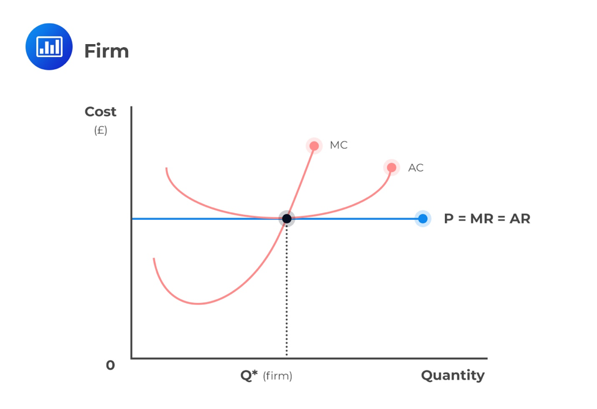
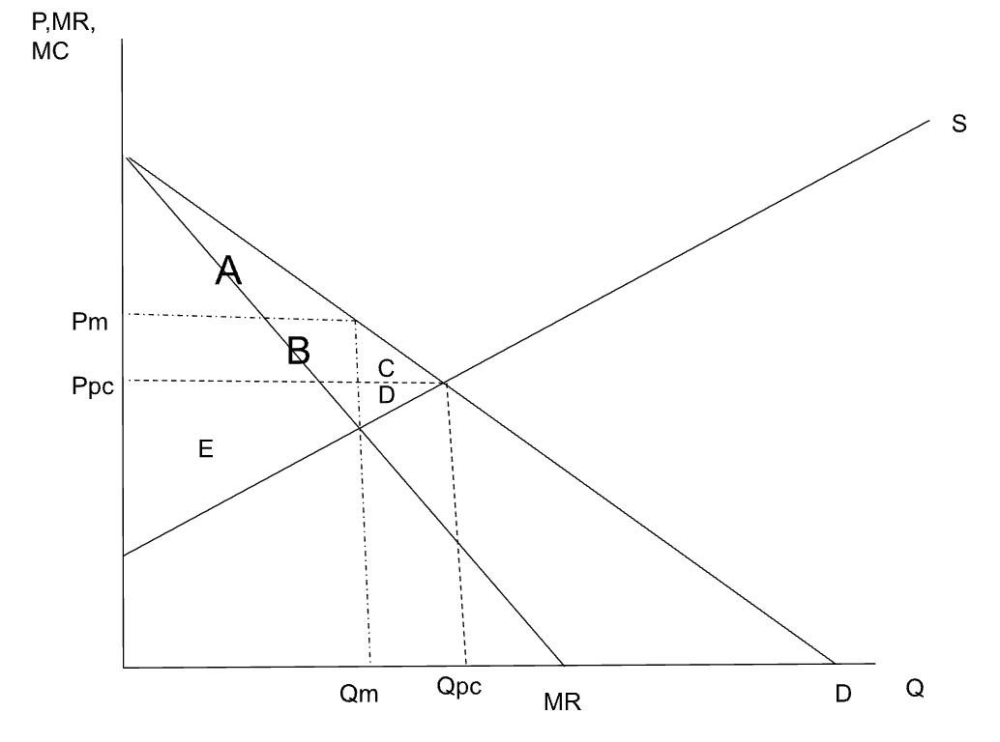
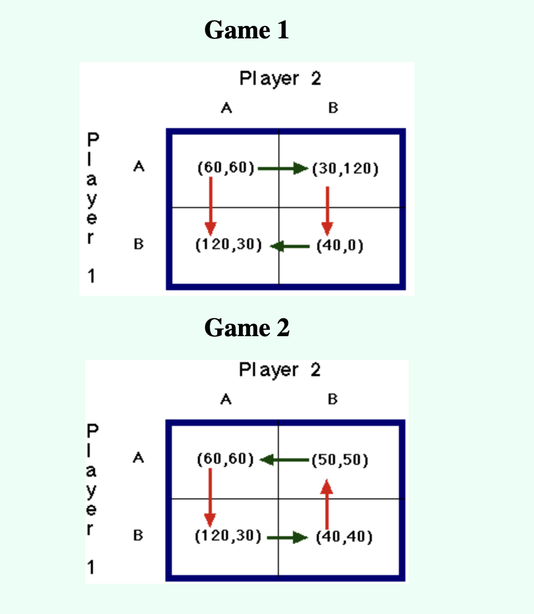

# Microeconomics - Exam 3 Notes

## Market Structure

### Perfect Competition

Profit maximization:

$$
P = MR = MC
$$

Where:

- $P$ is the price
- $MR$ is the marginal revenue (the change in total revenue from selling one more unit)
- $MC$ is the marginal cost (the change in total cost from producing one more unit)

Think, what would happen if $P > MC$? The firm would produce more units to increase profit. This would cause $MC$ to increase because of the law of diminishing returns. So, $MC$ would increase until $P = MC$.

#### Characteristics

- There are many buyers and sellers
- They produce homogeneous (identical) products
- There is free entry and exit (no barriers entry for new firms to enter the market)

A **price taker** is a firm that cannot influence the price of a good or service. They must accept the market price (Ex: farmers)

The firm is a price taker because TR is a straight line. If they increase the price, then they will sell 0 units. If they decrease the price, then they will sell more units, but the price will be lower.

#### Example

Given:

$$
\begin{align*}
TC = 0.5Q^2 \\
P = 15 \\
\end{align*}
$$

Find profit (TT)

$$
\begin{align*}
MC = \frac{\Delta TC}{\Delta Q} = Q \\
MC = Q = MR = P \\
Q = 15 \\

TR = PQ = 15(15) = 225 \\

TT = TR - TC = 225 - 0.5(15)^2 = 225 - 112.5 = 112.5 \\
\end{align*}
$$

#### Example 2

Given:

$$
\begin{align*}
TC = 3Q^3 - 18Q^2 + 30Q + 15 \\
\end{align*}
$$

Find the shut down price (min AVC = MC)

For this the variable cost is:

$$
VC = 3Q^3 - 18Q^2 + 30Q
$$

(The ones that are effected by the quantity)

$$
\begin{align*}
AVC = \frac{VC}{Q} = 3Q^2 - 18Q + 30 \\
MC = \frac{\Delta TC}{\Delta Q} = 9Q^2 - 36Q + 30 \\ \\

AVC = MC \\
3Q^2 - 18Q + 30 = 9Q^2 - 36Q + 30 \\
6Q^2 - 18Q = 0 \\
Q(6Q - 18) = 0 \\
Q = 0, 3 \\

MC = 9(3)^2 - 36(3) + 30 = 3 \\
\end{align*}
$$

Q can't be 0 because that would mean that the firm is not producing anything. So, the shut down price is $P = 3$ i.e. the firm will shut if the price is less than 3 (they wont be able to cover their variable costs).

### Monopoly

Profit maximization:

$$
MR = MC
$$

Why?

- If $MR > MC$, then the firm can increase profit by producing more units
- If $MR < MC$, then the firm can increase profit by producing less units

#### Market Power

Market power is the ability of a firm to influence the market price of a good or service. A monopoly has market power because they are the only seller of a good or service.

$$
P > MR = MC
$$

The market power is indicated by the difference between $P$ and $MC$. The larger the difference, the more market power the firm has.

#### Example

Given:

$$
\begin{align*}
Q = 10 - 0.4P \\
MC = 5Q \\
\end{align*}
$$

Find profit maximizing price and quantity.

$$
\begin{align*}
TR = PQ \\
MR = \frac{\Delta TR}{\Delta Q} \\
MC = \frac{\Delta TC}{\Delta Q} \\
\end{align*}
$$

Profit is highest when MR ~ MC and MR > 0.

$$
\begin{align*}
P = 25 - 2.5Q \\
TR = PQ = 25Q - 2.5Q^2 \\
MR = \frac{\Delta TR}{\Delta Q} = 25 - 5Q \\ \\
MR = MC \\
25 - 5Q = 5Q \\
Q = 2.5 \\
P = 25 - 2.5(2.5) = 18.75 \\
\end{align*}
$$

#### Example 2

For the above problem, calculate the DWL.

$$
\begin{align*}
P_{m} = 18.75 \\
Q_{m} = 2.5 \\\\

MR = MC = P_{S} \\
25 - 5(2.5) = 12.5 = P_{S}

\end{align*}
$$

$$
\begin{align*}
P_{pc} = MC \\
25 - 2.5Q_{pc} = 5Q_{pc} \\
Q_{pc} = 3.33 \\
P_{pc} = 25 - 2.5(3.33) = 16.67 \\

\end{align*}
$$

$$
\begin{align*}
DWL = C + D \\
C = \frac{1}{2}(3.33 - 2.5)(16.67 - 12.5) + \frac{1}{2}(3.33 - 2.5)(18.75 - 16.67) = 2.59 \\
\end{align*}
$$

#### Characteristics

- There is only one seller
- They produce a unique product
- There are high barriers to entry (Ex: patents, government regulations, etc.)

They are **price makers** because they can influence the price of a good or service

## Four Market Model Summary

|                                       | Perfect Competition | Monopoly      | Oligopoly     | Monopolistic Competition |
| ------------------------------------- | ------------------- | ------------- | ------------- | ------------------------ |
| # Of Firm                             | Many                | One           | Few           | Many                     |
| Examples                              | Agriculture         | Utilities     | Automobiles   | Restaurants              |
| Barriers to Entry                     | None                | High          | High          | Low                      |
| Profit Maximization                   | $P = MR = MC$       | $MR = MC$     | $MR = MC$     | $MR = MC$                |
| Long Run Profit                       | $0$                 | $> 0$         | $> 0$         | $> 0$                    |
| Relationship of Price (P = AR) and MR | $P = AR = MR$       | $P > AR = MR$ | $P > AR = MR$ | $P > AR = MR$            |
| Relationship of Price and MC          | $P = MC$            | $P > MC$      | $P > MC$      | $P > MC$                 |
| Market Power                          | None                | High          | High          | Low                      |
| Product Differentiation               | None                | None          | Maybe         | Yes                      |

## Marginal Cost

This is the change in total cost from producing one more unit.

Why does P = MC?

- If $P > MC$, then the firm can increase profit by producing more units
- If the firm produces more units, then $MC$ will increase
- $MC$ will increase until $P = MC$

## Marginal Revenue

This is the change in total revenue from selling one more unit.

$$
MR = \frac{\Delta TR}{\Delta Q}
$$

## Monopoly vs Perfect Competition

- $P_m$ is the monopoly price
- $P_{pc}$ is the perfect competition price
- $Q_m$ is the monopoly quantity
- $Q_{pc}$ is the perfect competition quantity

$$
\begin{align*}
CS_{pc} = A + B + C \\
CS_m = A \\

PS_{pc} = E + D \\
PS_m = B + E \\

DWL_m = C + D \\
\end{align*}
$$

$DWL$ - **Dead Weight Loss** - The amount of surplus that is lost due to the monopoly

## Game Theory

**Dominant Strategy** - A strategy that is best for a player regardless of the strategies chosen by the other players

**Cournot Competition** - A model of imperfect competition in which firms choose quantities

**Olioopoly** - A market structure in which only a few sellers offer similar or identical products

(Gains for Player 1, Gains for Player 2)

- Horizontal Arrows - If Player 1 Plays
- Vertical Arrows - If Player 2 Plays

They start from where the play that the player is making and goes to the better outcome for the target player.

if theere are multiple arrows (both horizontal and vertical) going to the same box then that is **Nash Equilibrium**. This is the best outcome for both players.

(A*, B*) is the Nash Equilibrium. Meaning that if Player 1 plays A* and Player 2 plays B* then they will both get the best outcome.

**Maximin Strategy** - A strategy that elevates the minimum gain that can be earned (so that the player is not worse off)

### Prisoner's Dilemma

This is a game where the players are unable to cooperate and end up worse off.

**Cartel** - A group of firms acting in unison

**Collusion** - An agreement among firms in a market about quantities to produce or prices to charge

## Herfindahl-Hirschman Index (HHI)

This is a measure of market concentration. It is calculated by squaring the market share of each firm competing in a market and then summing the resulting numbers.

$$
HHI = \sum_{i=1}^{n} s_{i}^2
$$

Where:

- $s_{i}$ is the market share of firm $i$ (in %)

## Some other stuff

- ** Accounting Profit ** : Takes into account only explicit costs (Ex: rent, wages, etc.)
- ** Economic Profit ** : Takes into account both explicit and implicit costs (Ex: opportunity cost)
