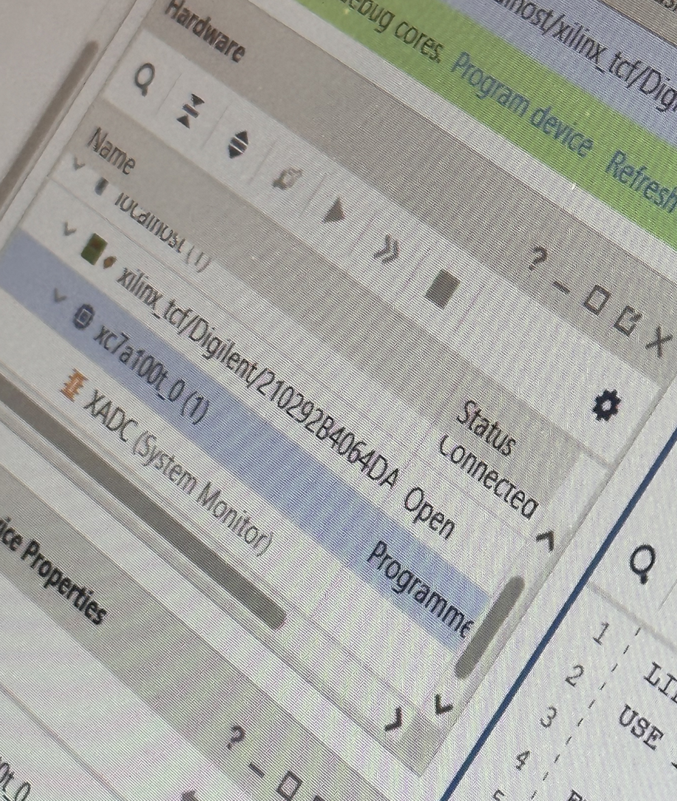
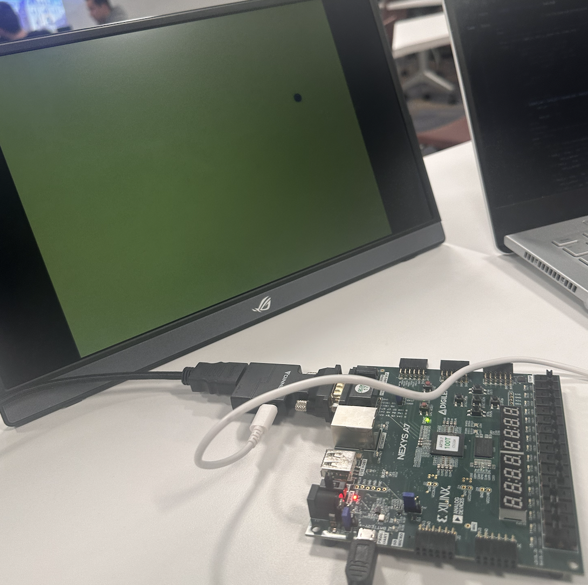

# Lab 3 - Bouncing Ball

## Initial Run



The initial program was upload succesfully. The ball is observed bouncing between two walls. There is only motion in one dimension.

## Modification 1 - Changing the size of the ball

```vhdl
CONSTANT size  : INTEGER := 8;
```

From the given code, in `ball.vhd` we can see that the size of the ball is defined as a constant.

### How is this used?

```vhdl
IF (pixel_col >= ball_x - size) AND
		 (pixel_col <= ball_x + size) AND
			 (pixel_row >= ball_y - size) AND
			 (pixel_row <= ball_y + size) THEN
				ball_on <= '1';
ELSE
	ball_on <= '0';
END IF;
```

and in

```vhdl
IF ball_y + size >= 600 THEN
	ball_y_motion <= "11111111100"; -- -4 pixels
ELSIF ball_y <= size THEN
	ball_y_motion <= "00000000100"; -- +4 pixels
END IF;
ball_y <= ball_y + ball_y_motion; -- compute next ball position
```

The **size** is used in two places.

1. To determine which pixels to turn on for the ball (used to determine what color should be displayed at that pixel)
2. To determine when the ball should bounce off the top and bottom walls.

### Changing the size

To change the size we simply change the value of the constant.

```vhdl
CONSTANT size  : INTEGER := 10;
```

## Modification 2 - Changing the color

We note this line in `ball.vhd`

```vhdl
red <= '1'; -- color setup for red ball on white background
green <= NOT ball_on;
blue  <= NOT ball_on;
```

This is obviously where the color of each pixel is determined

If **ball_on** is true (the pixel is within the ball) then the RGB is set to 1,0,0 (red) and if it is false (the pixel is outside the ball) then the RGB is set to 1,1,1 (white).

### Changing the color

So it makes sense that simply changing the pixel that is always 1 to a different color will change the color of the ball.

```vhdl
red <= NOT ball_on;
green <= NOT ball_on;
blue  <= '1'; -- now the ball is blue
```

## Modification 3 - Changing the shape of the ball

If we remember from before this is how we determined which pixels to turn on for the ball

```vhdl
IF (pixel_col >= ball_x - size) AND
		 (pixel_col <= ball_x + size) AND
			 (pixel_row >= ball_y - size) AND
			 (pixel_row <= ball_y + size) THEN
				ball_on <= '1';
ELSE
	ball_on <= '0';
END IF;
```

In other words, if a particular pixel_col and pixel_row are within this square boundary set by the ball_x and ball_y with the size of the ball then the pixel is part of the ball.

### Changing the shape

Now to make the ball an actual ball we need to redefine this boundary.

```vhdl
-- Change to circle
IF (CONV_INTEGER(pixel_col) - CONV_INTEGER(ball_x)) * (CONV_INTEGER(pixel_col) - CONV_INTEGER(ball_x)) + (CONV_INTEGER(pixel_row) - CONV_INTEGER(ball_y)) * (CONV_INTEGER(pixel_row) - CONV_INTEGER(ball_y)) <= size * size THEN
	ball_on <= '1';
ELSE
	ball_on <= '0';
END IF;
```

This is built off the distance formula:

$$
d = \sqrt{(x_2 - x_1)^2 + (y_2 - y_1)^2} \\
d^2 = (x_2 - x_1)^2 + (y_2 - y_1)^2
$$

The distance between the center of the ball (ball_x and y) should not be greater than the size of the ball. If it is then the pixel is not part of the ball.

## Modification 4 - Adding motion in the x direction

I already showed how the motion in the y direction is implemented. The motion in the x direction is implemented by simply expanding that statement to include the x direction.

```vhdl
-- allow for bounce off top or bottom of screen
IF ball_y + size >= 600 THEN
	ball_y_motion <= "11111111100"; -- -4 pixels
ELSIF ball_y <= size THEN
	ball_y_motion <= "00000000100"; -- +4 pixels
END IF;
IF ball_x + size >= 800 THEN
	ball_x_motion <= "11111111100"; -- -4 pixels
ELSIF ball_x <= size THEN
	ball_x_motion <= "00000000100"; -- +4 pixels
END IF;
ball_y <= ball_y + ball_y_motion; -- compute next ball position
ball_x <= ball_x + ball_x_motion;
```

In this, if the ball hits one of the side walls, the motion in the x direction is reversed, but it retains the motion in the y direction- and vice versa.

Note that we also had to declare a new signal for the motion in the x direction.

```vhdl
SIGNAL ball_x_motion : STD_LOGIC_VECTOR(10 DOWNTO 0) := "00000000100";
```

## Final Product



In our final design, we have a ball that bounces around the screen. The ball is blue, a bit bigger, and is a circle.
