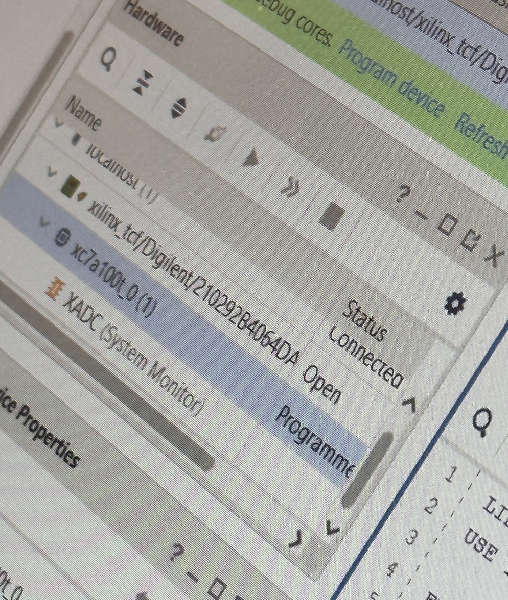

# Lab 4

## Initial Result

We were given a program that would use VHDL to add two numbers. The numbers are inputed through a keypad in hexadecimal and displayed on 4 7-segment displays.



## Modifications

### Modification 1 - Removing the trailing zeros

We add a bit to the **data4** signal in the `leddec16.vhd` file (from 4 to 5):

```vhdl
SIGNAL data4 : STD_LOGIC_VECTOR (4 DOWNTO 0); -- binary value of current digit
```

This bit will be used as a flag to determine if the current digit is a trailing zeros; and thus not to be displayed.

To determine if the current digit is a trailing zero, we add the following code to the `leddec16.vhd` file:

```vhdl
data4(0) <=
		'1' WHEN data(15 DOWNTO 12) = "0000" AND dig = "011" ELSE -- If the last digit is 0, turn off the last digit
		'1' WHEN data(15 DOWNTO 8) = "00000000" AND dig = "010" ELSE -- If the last two digits are 0, turn off the last two digits
		'1' WHEN data(15 DOWNTO 4) = "000000000000" AND dig = "001" ELSE -- If the last three digits are 0, turn off the last three digits
		'0	-- Otherwise, turn on the last digit


```

Now because we added another bit we must modify the way we set **data4** to only use the first 4 bits, and then the last bit is set with the above code:

```vhdl
-- Select digit data to be displayed in this mpx period
data4(4 DOWNTO 1) <= data(3 DOWNTO 0) WHEN dig = "000" ELSE -- digit 0
	        data(7 DOWNTO 4) WHEN dig = "001" ELSE -- digit 1
	        data(11 DOWNTO 8) WHEN dig = "010" ELSE -- digit 2
	        data(15 DOWNTO 12); -- digit 3
```

Now when we are displaying the digit of the trailing zero we know to set the value to `1111111` indicating that none of the segments should be lit.

```vhdl
-- Turn on segments corresponding to 4-bit data word
seg <= "0000001" WHEN data4 = "00000" ELSE -- 0
        "1001111" WHEN data4 = "00010" ELSE -- 1
        "0010010" WHEN data4 = "00100" ELSE -- 2
        "0000110" WHEN data4 = "00110" ELSE -- 3
        "1001100" WHEN data4 = "01000" ELSE -- 4
        "0100100" WHEN data4 = "01010" ELSE -- 5
        "0100000" WHEN data4 = "01100" ELSE -- 6
        "0001111" WHEN data4 = "01110" ELSE -- 7
        "0000000" WHEN data4 = "10000" ELSE -- 8
        "0000100" WHEN data4 = "10010" ELSE -- 9
        "0001000" WHEN data4 = "10100" ELSE -- A
        "1100000" WHEN data4 = "10110" ELSE -- B
        "0110001" WHEN data4 = "11000" ELSE -- C
        "1000010" WHEN data4 = "11010" ELSE -- D
        "0110000" WHEN data4 = "11100" ELSE -- E
        "0111000" WHEN data4 = "11110" ELSE -- F
        "1111111";
```


### Modification 2 - Implementing Subtraction

To implement the subtraction we must register the new pin in the `hexcalc.xdc` file

```xdc
set_property -dict { PACKAGE_PIN P18   IOSTANDARD LVCMOS33 } [get_ports { bt_sub }]; #IO_L9N_T1_DQS_D13_14 Sch=btnd
```

Now we have a new input port that we can implement in `hexcalc.vhd`:

```vhdl
PORT (
	clk_50MHz : IN STD_LOGIC; -- system clock (50 MHz)
	SEG7_anode : OUT STD_LOGIC_VECTOR (7 DOWNTO 0); -- anodes of eight 7-seg displays
	SEG7_seg : OUT STD_LOGIC_VECTOR (6 DOWNTO 0); -- common segments of 7-seg displays
	bt_clr : IN STD_LOGIC; -- calculator "clear" button
	bt_plus : IN STD_LOGIC; -- calculator "+" button
	bt_eq : IN STD_LOGIC; -- calculator "=" button
	KB_col : OUT STD_LOGIC_VECTOR (4 DOWNTO 1); -- keypad column pins

	bt_sub : IN STD_LOGIC; -- calculator "-" button
	KB_row : IN STD_LOGIC_VECTOR (4 DOWNTO 1)
	); -- keypad row pins
```

Now in our signal declaration we introduce a new type variable that will indicate what operation to perform:

```vhdl
--Type of Operation
TYPE operation IS (ADD, SUB);
SIGNAL op : operation;
```

When we can set the operation to ADD or SUB based on the button pressed:

```vhdl
IF kp_hit = '1' THEN
    nx_acc <= acc(11 DOWNTO 0) & kp_value;
    nx_state <= ACC_RELEASE;
ELSIF bt_plus = '1' THEN
    nx_state <= START_OP;
    op <= ADD;
ELSIF bt_sub = '1' THEN
    nx_state <= START_OP;
    op <= SUB;
ELSE nx_state <= ENTER_ACC;
END IF;
```

And when the equal button is pressed we can perform the operation:

```vhdl
IF op = ADD THEN
    nx_acc <= acc + operand;
ELSIF op = SUB THEN
    nx_acc <= acc - operand;
END IF;

nx_state <= SHOW_RESULT;
```

### Final Comments

Now we have a working calculator that can add and subtract numbers while also removing trailing zeros. Overal, this lab gave us a good grasp on how to use VHDL to implement a calculator.

### GitHub

https://github.com/mattraghu/Fall2023/tree/master/CPE487/Lab4
