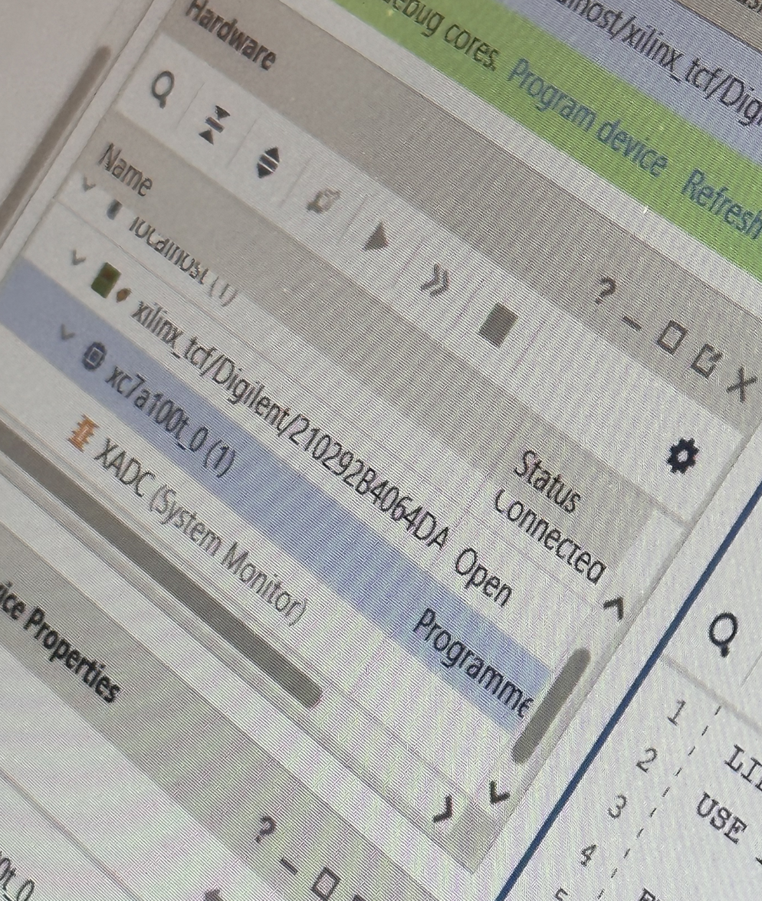
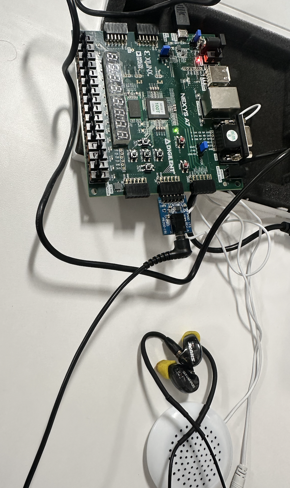

# Lab 5 - Siren Lab

## Initial Results

After the program was succesfully uploaded to the board, the speaker started to play a siren sound. The pitch of the siren increase and decreased repeatedly. Both the left and right channels played the same sound.



## Step 1 - Generating a new wave form in the shape of a square

The modulation of the sound was due to the fact that the sound wave was a triangle wave. For this modification, we introduce and output a new wave in the shape of a square wave.

### Identifying what to change

The `tone.vhd` file consisted of this line that generated the triangle wave:

```vhdl
WITH quad SELECT
data <= index WHEN "00", -- 1st quadrant
	    16383 - index WHEN "01", -- 2nd quadrant
	    0 - index WHEN "10", -- 3rd quadrant
	    index - 16383 WHEN OTHERS; -- 4th quadrant
```

In this

- `quad` is the quadrant of the triangle wave (1st, 2nd, 3rd, or 4th)
- `data` is the output of the triangle wave
- `index` is the index of the triangle wave (the x-axis)

It is obvious that the triangle wave is generated by the `index` variable. The `index` variable is incremented by 1 every clock cycle. The `index` variable is reset to 0 when it reaches 32767. This means that the triangle wave will have a period of 32767 clock cycles.

### Changing the Code

We first introduce a new port that will output the square wave in the port list:

```vhdl
data_square : OUT SIGNED (15 DOWNTO 0)
```

Now we can output the square wave to the `data_square` port:

```vhdl
--Transform into a square wave
WITH quad SELECT
data_square <= -16383 WHEN "00", -- 1st quadrant
	    -16383 WHEN "01", -- 2nd quadrant
	    16383 WHEN "10", -- 3rd quadrant
	    16383 WHEN OTHERS; -- 4th quadrant
```

This will set the pitch to the maximum value when the triangle wave is in the 3rd and 4th quadrants, and set the pitch to the minimum value when the triangle wave is in the 1st and 2nd quadrants.

Now to keep things simple I won't write every single modification here. But the output of tone is passed into the wail entity which then need to output that to `siren.vhd`. Thus the ports are modified in each script to consist of this new `data_square` port.

After all that, in our `siren.vhd` architecture, this data is eventually passed into two signals `data_tri` and `data_square`.

```vhdl
w1 : wail
PORT MAP(
	lo_pitch => lo_tone, -- instantiate wailing siren
	hi_pitch => hi_tone,
	wspeed => wail_speed,
	wclk => slo_clk,
	audio_clk => audio_clk,
	audio_data => data_tri,
	audio_data_square => data_square
);
```

Now we could just output the data_square signal and that would work, but we want to be able to change between the triangle and square wave using a button.

## Step 2 - Adding a button to switch between the triangle and square wave

### Identifying what to change

In the base script, the output for the left channel (dupilicated to the right) is set with the line:

```vhdl
data_L <= data;
```

So we just need to use a process to vary what data to take from (data_tri or data_square) based on the button state.

### Changing the Code

First a new pin is registered to a port in the `siren.xdc` file:

```vhdl
# Change Shape Button
set_property -dict { PACKAGE_PIN M18   IOSTANDARD LVCMOS33 } [get_ports { bt_change_shape }]; #IO_L4N_T0_D05_14 Sch=btnu
```

I'm not gonna show the port definitions anymore because it's repetitive but just know that the button is registered to the `bt_change_shape` port in the `siren.vhd` file as well.

Now we replace that line with a process:

```vhdl
-- this process selects between triangle and square waveforms
select_pr : PROCESS (bt_change_shape)
BEGIN
    IF bt_change_shape = '1' THEN
        data_L <= data_square;
    ELSE
        data_L <= data_tri;
    END IF;
END PROCESS;
```

## Step 3 - Changing the wail speed with switches

### Identifying what to change

We were easily able to identify what constant affected the wail speed.

```vhdl
w1 : wail
PORT MAP(
	lo_pitch => lo_tone, -- instantiate wailing siren
	hi_pitch => hi_tone,
	wspeed => wail_speed,
	wclk => slo_clk,
	audio_clk => audio_clk,
	audio_data => data_tri,
	audio_data_square => data_square
);
```

Obviously, it was the `wail_speed` constant

### Changing the Code

After changing `wail_speed` to a signal, we can then use a port of length 8 that is connected to the switches to set the value of `wail_speed`.

First we register the switches to a port in the `siren.xdc` file:

```vhdl
# Wailing Speed Switches
set_property -dict {PACKAGE_PIN J15 IOSTANDARD LVCMOS33} [get_ports {SW_SPD[0]}]
set_property -dict {PACKAGE_PIN L16 IOSTANDARD LVCMOS33} [get_ports {SW_SPD[1]}]
set_property -dict {PACKAGE_PIN M13 IOSTANDARD LVCMOS33} [get_ports {SW_SPD[2]}]
set_property -dict {PACKAGE_PIN R15 IOSTANDARD LVCMOS33} [get_ports {SW_SPD[3]}]
set_property -dict {PACKAGE_PIN R17 IOSTANDARD LVCMOS33} [get_ports {SW_SPD[4]}]
set_property -dict {PACKAGE_PIN T18 IOSTANDARD LVCMOS33} [get_ports {SW_SPD[5]}]
set_property -dict {PACKAGE_PIN U18 IOSTANDARD LVCMOS33} [get_ports {SW_SPD[6]}]
set_property -dict {PACKAGE_PIN R13 IOSTANDARD LVCMOS33} [get_ports {SW_SPD[7]}]
```

Now it's as simple as just setting the value of `wail_speed` to the value of the switches:

```vhdl
--Change Wail Speed With Switches
wail_speed <= SW_SPD;
```

## Step 4 - Changing the shape and speed of the siren in the other channel

Instead of duplicating the output of the left channel to the right channel, we will go through and generate a whole other component for the right with different switches and another button mapped to change the shape of the wave.

### Identifying what to change

```vhdl
data_R <= data_L; -- duplicate data on right channel
```

Instead of duplicating it like this we will generate a whole other component for the right channel.

### Changing the code

A new set of switches and another button is defined:

```vhdl
# Wailing Speed Switches Right
set_property -dict {PACKAGE_PIN V10 IOSTANDARD LVCMOS33} [get_ports {SW_SPD_R[0]}]
set_property -dict {PACKAGE_PIN U11 IOSTANDARD LVCMOS33} [get_ports {SW_SPD_R[1]}]
set_property -dict {PACKAGE_PIN U12 IOSTANDARD LVCMOS33} [get_ports {SW_SPD_R[2]}]
set_property -dict {PACKAGE_PIN H6 IOSTANDARD LVCMOS33} [get_ports {SW_SPD_R[3]}]
set_property -dict {PACKAGE_PIN T13 IOSTANDARD LVCMOS33} [get_ports {SW_SPD_R[4]}]
set_property -dict {PACKAGE_PIN R16 IOSTANDARD LVCMOS33} [get_ports {SW_SPD_R[5]}]
set_property -dict {PACKAGE_PIN U8 IOSTANDARD LVCMOS33} [get_ports {SW_SPD_R[6]}]
set_property -dict {PACKAGE_PIN T8 IOSTANDARD LVCMOS33} [get_ports {SW_SPD_R[7]}]

# Wailing Speed Switches Right
set_property -dict { PACKAGE_PIN P18   IOSTANDARD LVCMOS33 } [get_ports { bt_change_shape_R }]; #IO_L4N_T0_D05_14 Sch=btnu
```

Then we went through and basically dupilicated everything done for the left channel to use new vars and signals for the right channel.

We end up with this process that uses the new button to change the shape of the wave:

```vhdl
w2 : wail_R
PORT MAP(
	lo_pitch => lo_tone, -- instantiate wailing siren
	hi_pitch => hi_tone,
	wspeed => wail_speed_R,
	wclk => slo_clk,
	audio_clk => audio_clk,
	audio_data => data_tri_R,
	audio_data_square => data_square_R
);
```

Then we set the output of the right channel to the new data:

```vhdl
-- this process selects between triangle and square waveforms for the right
select_pr_R : PROCESS (bt_change_shape_R)
BEGIN
	IF bt_change_shape_R = '1' THEN
		data_R <= data_square_R;
	ELSE
		data_R <= data_tri_R;
	END IF;
END PROCESS;
```

## End Result

So now after connecting a pair of airbuds, we can hear the siren change pitch and shape based on the switches and buttons. Each earbud plays a different sound based on which switches and buttons are pressed.


