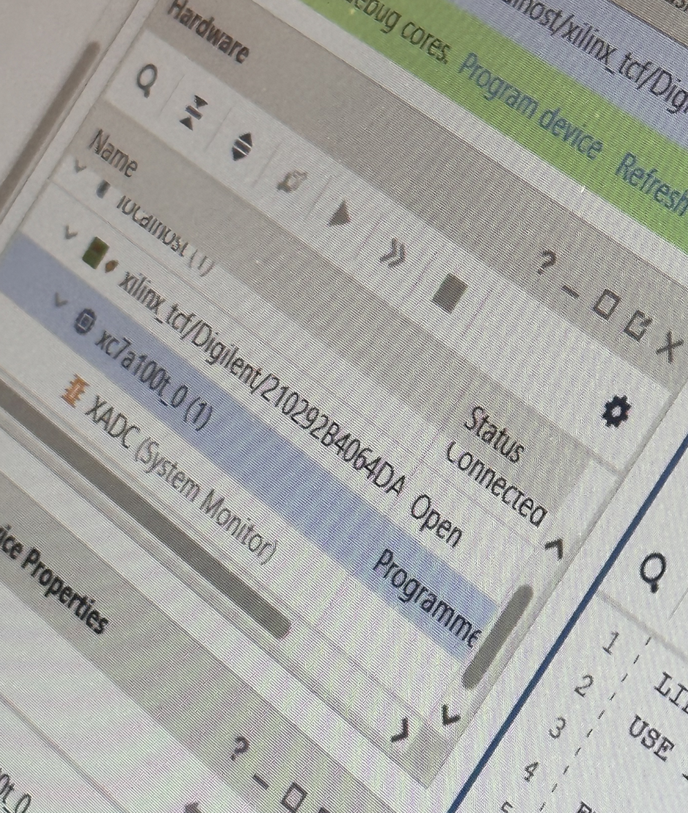
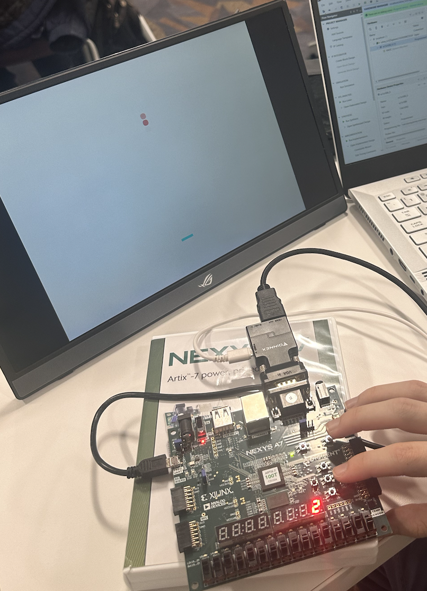
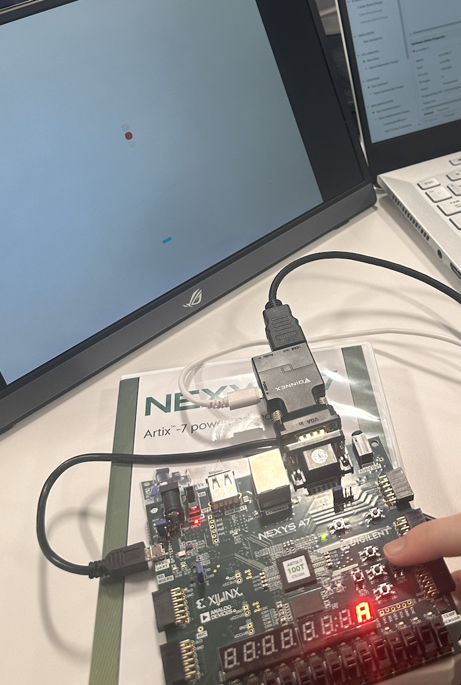

# Lab 6 - Pong Lab Part 2

## Initial Results

After the program was succesfully uploaded to the board, and the start game button was hit, the ball moved across the screen. The bat could be controlled with the other two buttons, and the ball would bounce off the bat and the screen.



## Step 1 - Changing the ball speed

For this section we will change the speed of the ball from 6 pixels per frame based on 6 input switches.

### Identifying what to change

The ball speed was set using this signal in the 'bat_n_ball.vhd' file:

```vhdl
SIGNAL ball_speed : STD_LOGIC_VECTOR (10 DOWNTO 0) := CONV_STD_LOGIC_VECTOR (6, 11);
```

### Changing the Code

To change it we will need to first define the switches in the port list:

```vhdl
SW_SPD : IN STD_LOGIC_VECTOR (5 DOWNTO 0);
```

Then we will need to change the signal to use the switches:

```vhdl
-- process to set ball speed based on switch position
-- But ensure its never 0
ball_speed(5 DOWNTO 0) <= SW_SPD WHEN SW_SPD /= "000000" ELSE "000001";
```

Here, the ball speed is set to the value of the switches, but if the switches are all off, the ball speed is set to 1. This is important because the ball speed is only updated when the ball bounces off of something or at the beginning of the game. If the ball speed is 0, the ball will move and even if we change the speed, it will not update until the ball bounces off of something.

`pong.vhd` and `pong.xdc` were also modified to include the new switches passing them to the `bat_n_ball` entity.

### How fast can we move the ball?

The ball can only be moved so fast before weird things start to happen.

Now the bat height is set here:

```vhdl
CONSTANT bat_h : INTEGER := 3; -- bat height in pixels
```

We have to make sure that the ball will not move through the bat otherwise the game will be unplayable. From our testing we found that the ball will move through the bat if the ball speed is set to 32 or higher. Thus we must make sure that the ball speed is never set to over 32.

## Step 2 - Changing the bat width

We want to double the initial bat width and decrease its size by 1 pixel every time the ball bounces off of it.

### Identifying what to change

The bat width was set using this constant in the 'bat_n_ball.vhd' file:

```vhdl
CONSTANT bat_w : INTEGER := 20; -- bat width in pixels
```

The part of the code that allows the ball to bounce off of the bat is:

```vhdl
-- allow for bounce off bat
IF (ball_x + bsize/2) >= (bat_x - bat_w) AND
    (ball_x - bsize/2) <= (bat_x + bat_w) AND
        (ball_y + bsize/2) >= (bat_y - bat_h) AND
        (ball_y - bsize/2) <= (bat_y + bat_h) THEN
        ball_y_motion <= (NOT ball_speed) + 1; -- set vspeed to (- ball_speed) pixels
END IF;
```

### Changing the Code

We will start by changing the constant to a signal and setting it to 40:

```vhdl
SIGNAL bat_w : INTEGER := 40; -- bat width in pixels
```

Now we will need to change the signal to decrease by 1 every time the ball bounces off of the bat:

```vhdl
-- allow for bounce off bat
IF (ball_x + bsize/2) >= (bat_x - bat_w) AND
    (ball_x - bsize/2) <= (bat_x + bat_w) AND
        (ball_y + bsize/2) >= (bat_y - bat_h) AND
        (ball_y - bsize/2) <= (bat_y + bat_h) THEN
        ball_y_motion <= (NOT ball_speed) + 1; -- set vspeed to (- ball_speed) pixels

        -- Decrease the width of the bat by 1 pixel
        bat_w <= bat_w - 1;
END IF;
```

## Step 3 - Adding a hit counter

We want to add a hit counter to the game that will be displayed on the 7-segment display.

### Changing the Code

We will start by adding the hit counter to the port list:

```vhdl
hits : OUT STD_LOGIC_VECTOR (15 DOWNTO 0) -- number of times ball hits bat
```

We'll also need a buffer to read from.

```vhdl
SIGNAL hits_buffer : STD_LOGIC_VECTOR (15 DOWNTO 0) := (OTHERS => '0');
```

Now we will need to change the signal to increase by 1 every time the ball bounces off of the bat:

```vhdl
-- allow for bounce off bat
IF (ball_x + bsize/2) >= (bat_x - bat_w) AND
    (ball_x - bsize/2) <= (bat_x + bat_w) AND
        (ball_y + bsize/2) >= (bat_y - bat_h) AND
        (ball_y - bsize/2) <= (bat_y + bat_h) THEN
        ball_y_motion <= (NOT ball_speed) + 1; -- set vspeed to (- ball_speed) pixels

        -- Decrease the width of the bat by 1 pixel
        bat_w <= bat_w - 1;

        -- Increase the hit counter by 1
        hits_buffer <= hits_buffer + 1;
END IF;
```

and set the hits signal to the buffer:

```vhdl
hits <= hits_buffer;
```

The `leddec16.vhd` file from our previous lab was used to display the hit counter on the 7-segment display. It's added to the `pong_2.vhd` file. Its prcoess port map is shown below:

```vhdl
led1 : leddec16
PORT MAP(
    dig => mpx, data => display,
    anode => anode, seg => seg
);
```

Where:

```vhdl
SIGNAL mpx : STD_LOGIC_VECTOR (2 DOWNTO 0); -- 7-seg multiplexing clock
SIGNAL cnt : std_logic_vector(20 DOWNTO 0); -- counter to generate timing signals
```

```vhdl
add_bb : bat_n_ball
PORT MAP(--instantiate bat and ball component
    v_sync => S_vsync,
    pixel_row => S_pixel_row,
    pixel_col => S_pixel_col,
    bat_x => batpos,
    serve => btn0,
    -- SW => SW,
    SW_SPD => SW_SPD,
    red => S_red,
    green => S_green,
    blue => S_blue,
    hits => display
);
```

```vhdl
mpx <= cnt(19 DOWNTO 17);
```

## Results

Now we have a working game with a hit counter. From our tests we were able to hit it 10 times before on our best trial.



