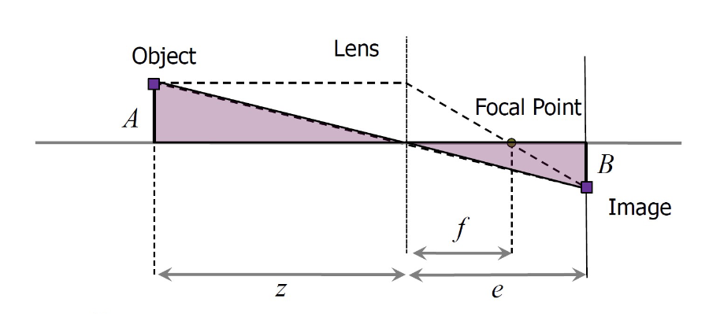

# Midterm

## Problem 1

$$
\dot{\xi}_R =
\begin{bmatrix}
\dot{x}_R \\
\dot{y}_R \\
\dot{\theta}_R
\end{bmatrix}
=
R(\theta)\dot{\xi}_I=
\begin{bmatrix}
\cos\theta & \sin\theta & 0 \\
-\sin\theta & \cos\theta & 0 \\
0 & 0 & 1
\end{bmatrix}
\begin{bmatrix}
\dot{x}_I \\
\dot{y}_I \\
\dot{\theta}_I
\end{bmatrix}
$$

Given:

- $\theta = \pi/2$
- $\dot{\xi}_R = \begin{bmatrix} 3 \\ 5 \\ 1 \end{bmatrix}$

$$
\begin{bmatrix}
\cos\theta & \sin\theta & 0 \\
-\sin\theta & \cos\theta & 0 \\
0 & 0 & 1
\end{bmatrix}
\begin{bmatrix}
\dot{x}_I \\
\dot{y}_I \\
\dot{\theta}_I
\end{bmatrix}
=
\begin{bmatrix}
0 & 1 & 0 \\
-1 & 0 & 0 \\
0 & 0 & 1
\end{bmatrix}
\begin{bmatrix}
\dot{x}_I \\
\dot{y}_I \\
\dot{\theta}_I
\end{bmatrix}
=
\begin{bmatrix}
\dot{y}_I \\
-\dot{x}_I \\
\dot{\theta}_I
\end{bmatrix}
=
\begin{bmatrix}
3 \\
5 \\
1
\end{bmatrix}
$$

$$
\begin{align}
\dot{y}_I &= 3 \\
-\dot{x}_I &= 5 \\
\dot{\theta}_I &= 1
\end{align}
$$

$$
\boxed{
\begin{align*}
\dot{x}_I &= -5 \\
\dot{y}_I &= 3 \\
\dot{\theta}_I &= 1
\end{align*}
}
$$

## Problem 2

Degree of mobility:

$$
\delta_m = 3 - \text{rank}[C_1(\beta_s)]
$$

Degree of steerability:

$$
\delta_s = \text{rank}[C_{1s}(\beta_s)]
$$

Degree of maneuverability:

$$
\delta_M = \delta_m + \delta_s
$$

## Bicycle

- 1 fixed wheel at the back : 1 sliding constraint
- 1 steerable wheel at the front : 1 sliding constraint, 1 steering constraint

## Automobile

- 2 fixed wheels at the back in one axle : 1 sliding constraints
- 2 steerable wheels at the front in one axle : 1 sliding constraint, 1 steering constraint

## Differential Drive Robot

- 2 fixed wheels at the back in one axle : 1 sliding constraints
- 1 steerable wheel at the front

| Vehicle                  | $\delta_m$ | $\delta_s$ | $\delta_M$ |
| ------------------------ | ---------- | ---------- | ---------- |
| Bicycle                  | 1          | 1          | 2          |
| Automobile               | 1          | 1          | 2          |
| Differential Drive Robot | 2          | 0          | 2          |

## Problem 3

### 1. In a holonomic system, the measurement of the traveled distance of each wheel is sufficient to calculate the final position of the robot.

**True**. It's only in the presence of non-holonomic constraints that the traveled distance of each wheel is not sufficient to calculate the final position of the robot. Otherwise, we can use differential drive kinematics to calculate the final position of the robot.

### 2. Non-holonomic robot is able to move instantaneously in any direction in the space of its degree of freedom.

**False**. That would be a holonomic robot. A non-holonomic robot has constraints on its motion. For example, a differential drive robot can only move instantaneously in the direction of its heading.

### 3. The Microsoft Kinect sensor has an infrared projector, an infrared sensor, and a RGB camera. It uses its RGB camera for depth computation.

**False**. Depth can only be computer from a single camera if you have multiple images of a static scene from different viewpoints. The kinect can only take images of a scene from a single viewpoint. Thus, it uses the infrared projector and sensor to compute depth.

### 4. When characterizing sensor performance, _accuracy_ is the same concept as _precision_.

**False**. Accuracy is how close a measurement is to the true value. Precision is how close a measurement is to other measurements.

### 5. Compass is an exteroceptive, and passive sensor.

**True**. It measures the magnetic field of the earth, which is external to the robot. It does not emit any energy to measure the magnetic field.

## Problem 4

Like Triangle One:

$$
\begin{align*}
\frac{A}{z} &= \frac{B}{e} \\
A &= \frac{Bz}{e} \\
\end{align*}
$$

Like Triangle Two:

$$
\begin{align*}
\frac{A}{f} &= \frac{B}{e-f} \\
\end{align*}
$$

Substitute $A$ from Triangle One into Triangle Two:

$$
\begin{align*}
A(e-f) &= Bf \\
\frac{Bz}{e}(e-f) &= Bf \\
\frac{z}{e}(e-f) &= f \\
\end{align*} \\
\boxed{ z = \frac{fe}{e-f} } \\
$$
