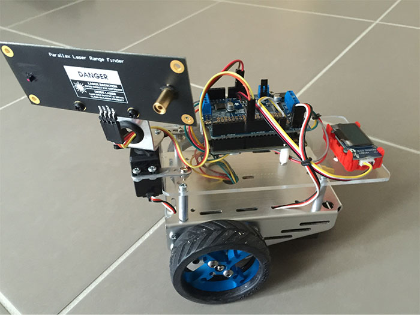
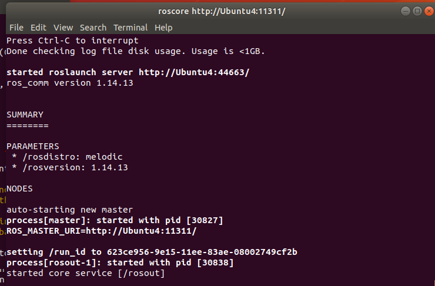
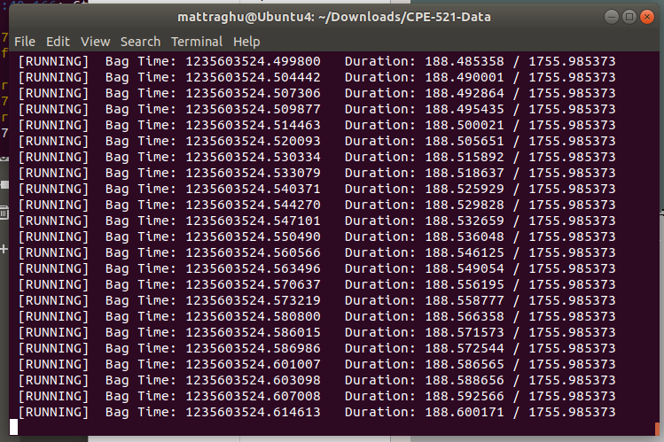
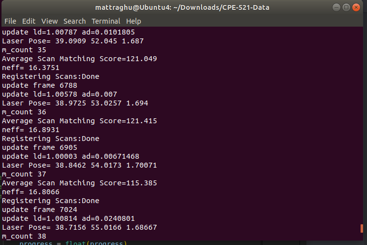
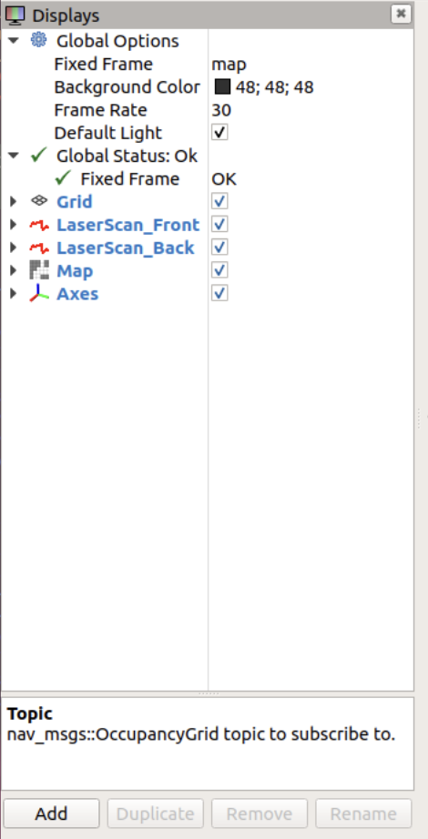
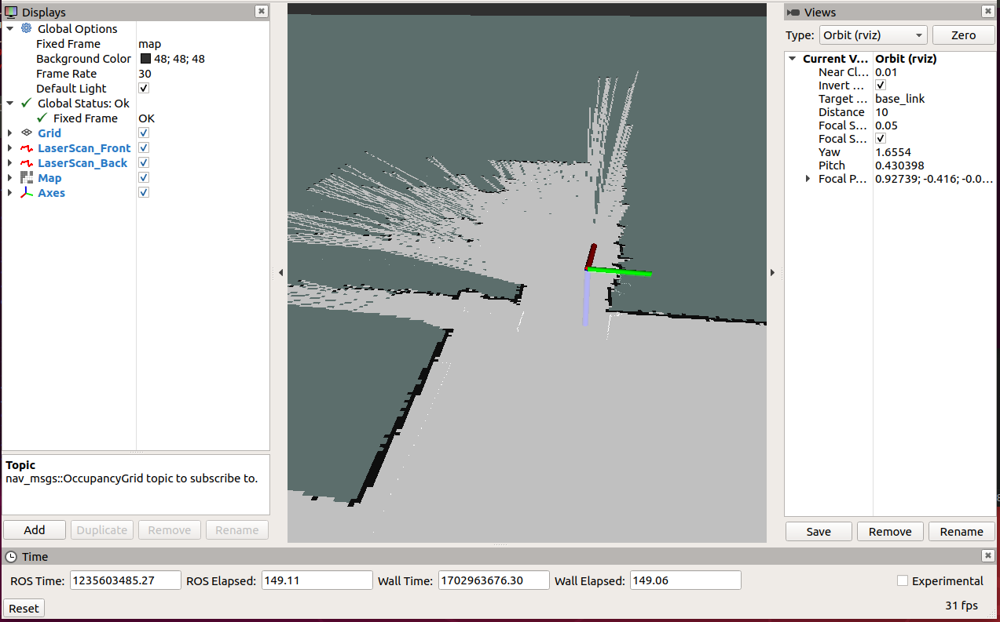

# CPE 521 - Final Project

The goal of this project is to utilize ROS to map an enviornment using SLAM given a dataset with the following data:

- Laser Scan Data
  - `front.csv`
  - `rear.csv`
- Odometry Data
  - `odom.csv`
- IMU Data
  - `imu.csv`

## Dataset

### Given Data

From the files given, we will only be using the odometry and laser scan data.

#### Laser Scan Data

2 Laser Range Finders were installed on the robot. One in the front and one in the rear.

An example of a hardware setup that might get us this data is shown below:


The data is stored in a CSV file with the following format:

- **Column 1:** timestamp (in seconds)
- **Column 4-185:** distance readings (in meters) from the front laser range finder

#### Odometry Data

Odometry data could be obtained from the robot's wheel encoders. The data is stored in a CSV file with the following format:

- **Column 1:** timestamp (in seconds)
- **Column 5:** x position (in meters)
- **Column 6:** y position (in meters)
- **Column 7:** orientation (in radians)

### Conversion

A 'bag' file is a ROS file format that stores ROS message data. We will be converting the given CSV files into a bag file to use with ROS.

The `csv_to_bag.py` script is ran and the bag file `output.bag` is created.

## SLAM

### Methodology

The robot will be using the `gmapping` package to perform SLAM.

The `gmapping` package is a ROS wrapper OpenSlam gmapping algorithm. It provides laser-based SLAM, as a ROS node. The SLAM approach is based on the Rao-Blackwellized particle filter utilizing range data from a laser range finder. The ROS node subscribes to the tf system and builds a map of the environment with a 2D occupancy grid using the laser and pose data.

### Implementation

It's installed using the following command:

```bash
sudo apt-get install ros-melodic-gmapping
```

And can be ran using the following command:

```bash
rosrun gmapping slam_gmapping scan:=base_scan
```

## Implementation

### Starting the ROS Core

```bash
roscore
```

This will start the ROS Master that will act as the central hub for all ROS nodes.



Note that we have to set the simluation to use simulated time so that the time stamp on the messages will be the same as the time stamp on the messages in the bag file.

This is done by running the following command:

```bash
rosparam set use_sim_time true
```

### Playing the Bag File

```bash
rosbag play output.bag
```

This will play the bag file and publish the messages to the ROS Master. Essentially, it will act as a live stream of the data as if it were coming from the robot in real time.



### Running the SLAM Node

```bash
rosrun gmapping slam_gmapping scan:=front
```

This will run the SLAM node and subscribe to the `front` topic that is being published by the bag file.

It will then publish the map to the `map` topic.



### GUI Visualization

```bash
rviz
```

This will open the RViz GUI.

The following displays are added and configured:

- **Map** - Displays the map. Configured to subscribe to the `map` topic.
- **LaserScan_Front** - Displays the laser scan data from the front laser range finder. Configured to subscribe to the `front` topic.
- **LaserScan_Rear** - Displays the laser scan data from the rear laser range finder. Configured to subscribe to the `rear` topic.
- **Axes** - Displays the robot's current position and orientation. Configured to subscribe to the `odom` topic.
- Grid - Displays a grid on the map.



## Results

The following is the map that was generated:



In simulation time, the robot was able to map the entire environment. From my tests, it seems that there is a slight delay between when the laser data is published and when the map is updated.

## Discussion

During this lab, I learned a lot about ROS and how it works overall. From the way that the nodes communicate with each other to the way that the messages are published and subscribed to. I also learned about the `gmapping` package and how it can be used to perform SLAM.

In fact, for one of my projects that I'm working on, I'm going to have to use ROS to implement a SLAM algorithm on an autonomous drone. While I'm not going to be using openslam's `gmapping` package, I will be using ROS to implement the SLAM algorithm. This lab helped me get a better understanding of how ROS works and how I can use it to implement SLAM.
